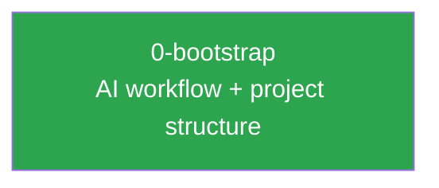

# bngtester — Project Summary

This file is the project-level state tracker. Every agent session should read this before starting new work. It tracks what has been built, key decisions that affect future work, and how specs relate to each other.

**Updated after every spec is finalized.**

## Current State

Nothing is built yet. The AI workflow, issue templates, and project structure are in place. Implementation starts from filed issues.

## Completed Specs

| Spec | Issue | Status | Summary |
|------|-------|--------|---------|
| [0-bootstrap](specs/0-bootstrap/) | N/A | Complete | AI workflow (PROCESS.md, CLAUDE.md), issue templates, README, contribution rules |

## Spec Dependencies

Legend: green = complete, blue = in progress, grey = planned

## Key Decisions

Decisions that affect future specs. Read these before proposing new work.

### From 0-bootstrap

- **Gemini produces review artifacts, not direct spec edits.** All review agents write to `spec-reviews/` — Claude is the only agent that modifies the spec itself (Phase 4).
- **Spec paths use `<issue-number>-<slug>/` convention.** Deterministic, derived from the GitHub issue.
- **One feature per PR, one PR per issue.** No bundling. Out-of-scope discoveries become new issues.
- **`approved` label gates work.** No spec work begins until the issue has the `approved` label.

## Codebase State

| Component | Exists | Notes |
|-----------|--------|-------|
| `images/` | No | No subscriber images built yet |
| `collector/` | No | Go collector not started |
| `.github/workflows/` | No | No CI pipelines yet |
| `context/` | Yes | Workflow docs and bootstrap spec |
| `.github/ISSUE_TEMPLATE/` | Yes | Feature, bug, enhancement, testing templates |
