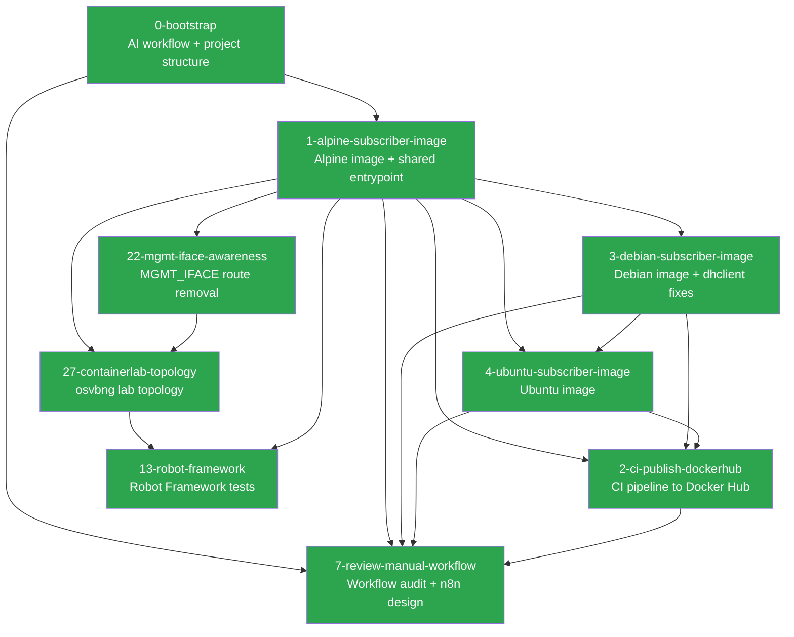

# bngtester — Project Summary

This file is the project-level state tracker. Every agent session should read this before starting new work. It tracks what has been built, key decisions that affect future work, and how specs relate to each other.

**Updated after every spec is finalized.**

## Current State

Three subscriber images (Alpine, Debian, and Ubuntu) are built and published to Docker Hub via a CI pipeline. The shared entrypoint script supports all access methods and encapsulation types, with auto-detected DHCP client dispatch for both dhcpcd and dhclient. A containerlab topology (`lab/`) deploys osvbng as a VPP-based BNG with a bngtester subscriber and FRR-based server for end-to-end IPoE validation — DHCP lease acquisition, gateway reachability, and cross-BNG connectivity through a real data plane. The AI workflow has been refined with early branching, priority labels, spec approval gates, and a standardized PR format. A workflow consistency audit (#7) found core spec/implementation phases consistently followed, with gaps in label lifecycle, Phase 6 tracking, and commit discipline — n8n has been selected as the automation tool to address these.

## Completed Specs

| Spec | Issue | Status | Summary |
|------|-------|--------|---------|
| [0-bootstrap](specs/0-bootstrap/) | N/A | Complete | AI workflow (PROCESS.md, CLAUDE.md), issue templates, README, contribution rules |
| [1-alpine-subscriber-image](specs/1-alpine-subscriber-image/) | [#1](https://github.com/veesix-networks/bngtester/issues/1) | Complete | Alpine subscriber image + shared entrypoint (VLAN, IPoE, PPPoE) |
| [3-debian-subscriber-image](specs/3-debian-subscriber-image/) | [#3](https://github.com/veesix-networks/bngtester/issues/3) | Complete | Debian 12 subscriber image + dhclient entrypoint fixes |
| [4-ubuntu-subscriber-image](specs/4-ubuntu-subscriber-image/) | [#4](https://github.com/veesix-networks/bngtester/issues/4) | Complete | Ubuntu 22.04 subscriber image (Dockerfile only, no entrypoint changes) |
| [2-ci-publish-dockerhub](specs/2-ci-publish-dockerhub/) | [#2](https://github.com/veesix-networks/bngtester/issues/2) | Complete | CI pipeline to build and publish subscriber images to Docker Hub |
| [7-review-manual-workflow](specs/7-review-manual-workflow/) | [#7](https://github.com/veesix-networks/bngtester/issues/7) | Complete | Workflow consistency audit + n8n automation design |
| [22-mgmt-iface-awareness](specs/22-mgmt-iface-awareness/) | [#22](https://github.com/veesix-networks/bngtester/issues/22) | Complete | Management interface default route removal |
| [27-containerlab-topology](specs/27-containerlab-topology/) | [#27](https://github.com/veesix-networks/bngtester/issues/27) | Complete | Containerlab topology with osvbng BNG, bngtester subscriber, FRR server |
| [5-rust-collector](specs/5-rust-collector/) | [#5](https://github.com/veesix-networks/bngtester/issues/5) | Complete | Rust collector — bngtester-server and bngtester-client binaries |
| [13-robot-framework](specs/13-robot-framework/) | [#13](https://github.com/veesix-networks/bngtester/issues/13) | Complete | Robot Framework test runner with standalone + BNG integration tests |
| [32-dscp-marking](specs/32-dscp-marking/) | [#32](https://github.com/veesix-networks/bngtester/issues/32) | Complete | DSCP/TOS marking on outgoing data stream packets |
| [33-ecn-marking](specs/33-ecn-marking/) | [#33](https://github.com/veesix-networks/bngtester/issues/33) | Complete | ECN marking and CE detection on test traffic |
| [34-per-stream-config](specs/34-per-stream-config/) | [#34](https://github.com/veesix-networks/bngtester/issues/34) | Complete | Per-stream size, rate, pattern overrides |
| [35-multi-subscriber](specs/35-multi-subscriber/) | [#35](https://github.com/veesix-networks/bngtester/issues/35) | Complete | Multi-subscriber concurrent sessions with combined reports |

## Spec Dependencies

Legend: green = complete, blue = in progress, grey = planned

## Key Decisions

Decisions that affect future specs. Read these before proposing new work.

### From #8, #9, #10, #11 (workflow improvements)

- **Branch at Phase 1, not Phase 5.** All work for an issue — spec artifacts, reviews, and code — lives on a single feature branch from the start. Review agents check out the branch.
- **Priority labels decouple order from issue number.** `priority:p0` (critical path), `priority:p1` (important), `priority:p2` (nice to have). All issue templates have a priority dropdown.
- **Spec approval gate between Phase 4 and Phase 5.** `spec:approved` label required before implementation. Human contributors open a draft PR for spec review. n8n auto-approves when no unresolved CRITICAL/HIGH findings.
- **PR creation is a required final step of Phase 5.** Conventional Commits title format. Standardized body template with summary, spec link, files, testing. Agent-agnostic attribution.

### From 1-alpine-subscriber-image

- **Shared entrypoint auto-detects DHCP client.** `images/shared/entrypoint.sh` uses `command -v dhcpcd` / `command -v dhclient` at runtime. Future images (Debian, Ubuntu) use the same script — no per-image entrypoints needed.
- **Build context is `images/`, not per-image.** All Dockerfiles use `docker build -f images/<distro>/Dockerfile images/` so they can COPY from `shared/`.
- **bng-client will replace the shell entrypoint.** The planned Rust binary handles VLAN setup, client management, and health reporting. The current entrypoint is the minimum viable approach.
- **Subscriber containers require a dedicated network interface.** Default Docker bridge is not suitable. Use `--network none` + injected veth/macvlan, a dedicated Docker network, or `--network host`.

### From 3-debian-subscriber-image

- **dhclient requires config file for DHCP_TIMEOUT.** dhclient has no CLI flag for timeout — the entrypoint generates `/tmp/dhclient-bngtester.conf` with `timeout N;` and passes it via `-cf`. Future images using dhclient inherit this automatically.
- **Debian images need `ca-certificates` and `netbase`.** `bookworm-slim` lacks CA certs (needed for curl HTTPS) and `/etc/protocols` + `/etc/services` (needed by networking tools). Future Debian-based images should include both.

### From 4-ubuntu-subscriber-image

- **Ubuntu ships `timeout 300;` in stock dhclient.conf.** The entrypoint's `generate_dhclient_conf()` handles this correctly by appending `timeout $DHCP_TIMEOUT;` at the end of the copied config — dhclient uses the last directive. Future dhclient-based images should verify their stock config for conflicting directives.
- **`DEBIAN_FRONTEND=noninteractive` for Ubuntu Dockerfiles.** Ubuntu's apt may trigger interactive prompts during package installation. Use `DEBIAN_FRONTEND=noninteractive` inline in the RUN command.

### From 2-ci-publish-dockerhub

- **Three-job pipeline: discover → build → push.** The push job only runs after all build legs succeed, preventing partial Docker Hub publication. The build job validates Dockerfiles without pushing.
- **Dynamic image discovery.** The workflow finds `images/*/Dockerfile` directories automatically. Adding a new subscriber image requires only its Dockerfile — no workflow edits needed.
- **`latest` strictly follows `main`.** Semver tags publish version tags only. `latest` is never updated by tag events.
- **PR trigger for build-only validation.** Pull requests targeting `main` run the build job without pushing, catching Dockerfile errors before merge.
- **Docker Hub secrets required.** `DOCKERHUB_USERNAME` and `DOCKERHUB_TOKEN` must be configured in repository settings.

### From 7-review-manual-workflow

- **n8n is the automation tool, self-hosted via Docker Compose on BSpendlove's server cluster.** PostgreSQL backend (not SQLite) for crash recovery of long-lived wait nodes.
- **Phase 4 auto-accept: CRITICAL requires human 👀 ack, HIGH auto-accepts, MEDIUM/LOW get 24hr grace period.** `/reject <ID> <rationale>` to reject, `/approve` or 🚀 to fast-track.
- **Review agents must commit and push artifacts.** PROCESS.md updated to require explicit commit+push for Phases 2, 3, and 6. This was the most common failure mode in manual workflow.
- **Labels are the automation contract.** Label drift on closed issues must be backfilled before n8n depends on them. n8n must own label lifecycle going forward.
- **Phase 6 is opt-in, not implied by agents:all-three.** Automation must use an explicit trigger (label or command), not infer intent from agent-selection labels.
- **Structured review contract needed before deterministic parsing.** Current review artifacts are free-form Markdown. n8n should use LLM parsing as interim, then migrate to a fixed format (YAML front matter, Markdown table, or JSON sidecar).
- **Stale issue policy uses explicit states.** `blocked`, `waiting-on-maintainer`, `snoozed` labels prevent premature auto-close. Only unmarked unapproved issues get stale-closed after 30+14 days.
- **Security model for self-hosted n8n.** Webhook HMAC verification, replay protection via `X-GitHub-Delivery`, least-privilege repo-scoped PAT, `/reject`/`/approve` command authorization (write-access only), repo and branch allow-listing, 90-day secret rotation, and audit logging for all repo-mutation actions.
- **Failure recovery and idempotency required.** Persisted run keys to prevent double-runs, webhook deduplication, PostgreSQL for wait-node crash recovery, partial failure handling with resume-from-failed-step, and watchdog timers (15min) for agent execution.
- **API-invoked agents need context injection.** When n8n invokes agents via API (not CLI), it must read and inject branch state (spec, source files, SUMMARY.md) into the prompt.

### From 22-mgmt-iface-awareness

- **`MGMT_IFACE` removes only the default route, not the interface.** The connected route for the management subnet is preserved so orchestrators can still reach the container's management IP. This is critical for containerlab and similar tools where management access is needed for API/metrics.

### From 5-rust-collector

- **Dual-channel architecture: control (TCP) + data (UDP/TCP).** Control channel handles negotiation, clock sync, heartbeat, and result exchange. Data channels carry test traffic with per-stream metrics.
- **UDP uses embedded CLOCK_MONOTONIC timestamps for one-way latency.** Only accurate when client and server share a kernel (containerlab, same host). Cross-host uses estimated offset via NTP-style ping-pong — results marked as "sync-estimated".
- **TCP metrics from TCP_INFO, not embedded timestamps.** TCP buffering makes per-packet timestamps unreliable. Instead, poll `tcpi_rtt`, `tcpi_total_retrans`, `tcpi_snd_cwnd` via getsockopt every 100ms.
- **Client is the primary report producer.** Client receives server metrics via control channel `results` message and merges with send-side metrics. Both sides can produce independent reports.
- **jemallocator for musl static binaries.** Musl's default allocator is a bottleneck at high packet rates. All binaries use jemalloc as the global allocator.
- **Multi-stage Docker builds with dependency caching.** Dockerfiles copy Cargo.toml/Cargo.lock first, do a dummy build to cache deps, then copy src/ for the real build. Build context changed from `images/` to repo root. `.dockerignore` excludes `.git/`, `context/`, `target/`.
- **Sequence number wrap-around at u32.** At 10Gbps with 64-byte packets, u32 wraps in ~5 minutes. Loss/reorder detection treats gaps > u32::MAX/2 as wraps.

### From 32-dscp-marking

- **DSCP set via socket2 before connect/send.** TCP sockets use create→set_tos→connect pattern so the SYN carries the marking. UDP sockets set TOS before any data is sent. Fail-fast if setsockopt fails — no silent fallback to best-effort.
- **Data streams only, not control channel.** DSCP marking targets test traffic only. Control channel TCP is not marked.
- **IPv4-only with explicit assertion.** IPv6 endpoints with `--dscp` produce a clear error. `IPV6_TCLASS` support is a future enhancement.
- **Per-stream DSCP overrides.** `--stream-dscp 0=AF41 --stream-dscp 1=BE` allows different traffic classes per stream. Config sent to server via hello message for reverse-path streams and report labeling.

### From 35-multi-subscriber

- **Server handles concurrent sessions via JoinSet.** Each session spawned as a tokio task with owned `Arc<ServerConfig>`. JoinSet provides supervision — panicked/failed tasks detected.
- **SessionRegistry tracks completed sessions.** Combined report waits for `--max-clients N` or `--timeout`. Failed sessions included with partial metrics.
- **Writer lock for concurrent stdout.** Per-session mode serializes stdout via `Arc<Mutex<()>>`. `--file` uses per-client naming (`{base}-{client_id}.{ext}`).
- **Client identified by `--client-id` or source IP:port.** Duplicate IDs get `-N` suffix. ID appears in combined report per-client sections.
- **Combined report formats.** `write_combined_json/text/junit()` — each client as a section/testsuite. Single-client without `--combined` works identically to before.

### From 34-per-stream-config

- **Unified `StreamConfigOverride` consolidates all per-stream overrides.** Size, rate, pattern, and DSCP in a single struct. Replaces the separate `StreamDscpConfig` from #32.
- **Per-stream parsing helpers in `src/stream/config.rs`.** Not in `dscp.rs` — keeps DSCP/ECN module focused. `StreamOverrides` collection with last-match-wins resolution.
- **Size validated >= HEADER_SIZE (32 bytes).** Rejected at parse time, not silently clamped by `build_packet()`. Rate 0 = unlimited, rendered as "unlimited" in text reports.
- **Scoped to current UDP path.** TCP generator per-stream config is future work when RRUL multi-stream is implemented.

### From 33-ecn-marking

- **ECN via `build_tos()` combining DSCP and ECN.** Replaces old `dscp_to_tos()`. Single TOS byte set once with both DSCP and ECN bits.
- **Receiver detects all 4 ECN states.** Not-ECT, ECT(0), ECT(1), CE tracked separately. Detects both AQM congestion signaling (CE) and ECN stripping (ECT→Not-ECT = BNG misconfiguration).
- **`recvmsg` via tokio `readable()` + `try_io()`.** Never blocking `libc::recvmsg` inside async task. IP_TOS cmsg parsed as `c_int`. Missing cmsg counted as unknown — CE ratio excludes unknowns.
- **ECN report fields omitted when ECN off.** Zero means "observed zero", not "not observed". Backward compatible with existing JSON consumers.

### From 27-containerlab-topology

- **Lab topology lives in `lab/`, not `tests/`.** The `lab/` directory contains the containerlab topology, osvbng config, FRR server config, smoke test, and README. Robot Framework tests (#13) will reference topologies from `lab/` rather than bundling their own.
- **osvbng test 18 is the reference pattern.** The topology is adapted from osvbng's own `tests/18-ipoe-linux-client/` — same IP scheme, same VLAN scheme (S-VLAN 100, C-VLAN 10), same OSPF design. This keeps the two repos aligned.
- **Server node is FRR, not bngtester-server.** The Rust collector (#5) defines `bngtester-server` but it is not implemented yet. The FRR-based server node provides OSPF routing and iperf3 as an interim far-side endpoint. When the Rust binary is ready, it can replace or augment this node.
- **`dataplane.lcp-netns` is required in osvbng.yaml.** Without `lcp-netns: dataplane`, VPP cannot sync interfaces into the Linux control plane namespace where FRR and DHCP operate. This must be present in any osvbng configuration used with containerlab.
- **Image override via environment variables.** `OSVBNG_IMAGE` and `BNGTESTER_IMAGE` allow swapping images at deploy time (e.g., testing Debian subscriber or local osvbng build). Use `sudo -E` to pass env vars through to containerlab.

### From 13-robot-framework

- **Two test tiers: standalone and integration.** Standalone tests (01-03) use `docker run` and need only Docker. Integration tests (04+) use containerlab + osvbng and are tagged `integration` for exclusion from CI.
- **Log-based verification for standalone VLAN/cleanup tests.** dhcpcd crashes in standalone Docker environments (sysctl restrictions), so VLAN creation is verified via entrypoint log messages rather than `docker exec ip link show`. This is a known limitation.
- **`sudo -E containerlab` preserves image override env vars.** Plain `sudo` strips environment variables. The `CLAB_BIN` variable in common.robot uses `sudo -E` so `OSVBNG_IMAGE` and `BNGTESTER_IMAGE` pass through to containerlab.
- **Image matrix via `--variable SUBSCRIBER_IMAGE:`** — all suites accept this Robot variable. Integration tests also accept `OSVBNG_IMAGE` for the BNG image.
- **Shared keyword interface matches osvbng's common.robot.** Same keyword signatures (Deploy Topology, Destroy Topology, Wait For osvbng Healthy, Execute VPP Command, etc.) enable future interop where osvbng tests can import bngtester keywords.

### From 0-bootstrap

- **Gemini produces review artifacts, not direct spec edits.** All review agents write to `spec-reviews/` — Claude is the only agent that modifies the spec itself (Phase 4).
- **Spec paths use `<issue-number>-<slug>/` convention.** Deterministic, derived from the GitHub issue.
- **One feature per PR, one PR per issue.** No bundling. Out-of-scope discoveries become new issues.
- **`approved` label gates work.** No spec work begins until the issue has the `approved` label.

## Codebase State

| Component | Exists | Notes |
|-----------|--------|-------|
| `images/` | Yes | Alpine + Debian + Ubuntu images, shared entrypoint (`images/shared/entrypoint.sh`, `images/alpine/Dockerfile`, `images/debian/Dockerfile`, `images/ubuntu/Dockerfile`) |
| `lab/` | Yes | Containerlab topology (`bngtester.clab.yml`), osvbng config, FRR server config, smoke test, README |
| `tests/` | Yes | Robot Framework suites: `01-entrypoint-validation`, `02-vlan-modes`, `03-cleanup` (standalone), `04-ipoe-bng` (integration). Shared keywords in `common.robot` + `subscriber.robot`. Runner: `rf-run.sh` |
| `src/` | Yes | Rust crate — `bngtester-server` and `bngtester-client` binaries. Packet format, control protocol, metrics (latency/jitter/loss/throughput/time-series), report formatters (JSON/JUnit/JSONL/text). Client binary included in subscriber images via multi-stage Docker build. |
| `.github/workflows/` | Yes | `publish-images.yml` — builds and publishes subscriber images to Docker Hub |
| `context/` | Yes | Workflow docs and bootstrap spec |
| `.github/ISSUE_TEMPLATE/` | Yes | Feature, bug, enhancement, testing templates |
