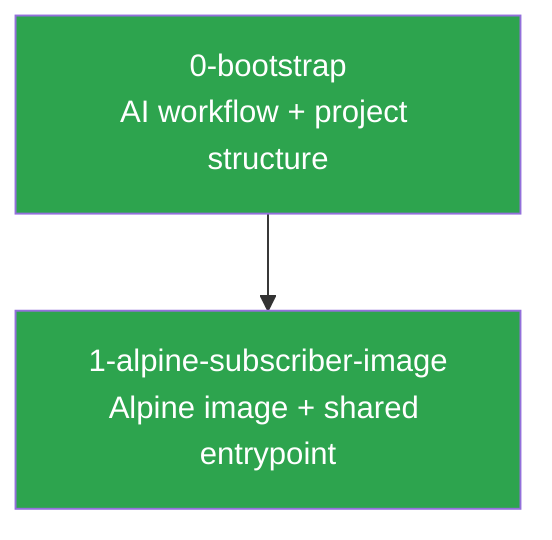

# bngtester — Project Summary

This file is the project-level state tracker. Every agent session should read this before starting new work. It tracks what has been built, key decisions that affect future work, and how specs relate to each other.

**Updated after every spec is finalized.**

## Current State

The first subscriber image (Alpine) is built. The shared entrypoint script supports all access methods and encapsulation types, with auto-detected DHCP client dispatch. The AI workflow has been refined with early branching, priority labels, spec approval gates, and a standardized PR format.

## Completed Specs

| Spec | Issue | Status | Summary |
|------|-------|--------|---------|
| [0-bootstrap](specs/0-bootstrap/) | N/A | Complete | AI workflow (PROCESS.md, CLAUDE.md), issue templates, README, contribution rules |
| [1-alpine-subscriber-image](specs/1-alpine-subscriber-image/) | [#1](https://github.com/veesix-networks/bngtester/issues/1) | Complete | Alpine subscriber image + shared entrypoint (VLAN, IPoE, PPPoE) |

## Spec Dependencies

Legend: green = complete, blue = in progress, grey = planned

## Key Decisions

Decisions that affect future specs. Read these before proposing new work.

### From #8, #9, #10, #11 (workflow improvements)

- **Branch at Phase 1, not Phase 5.** All work for an issue — spec artifacts, reviews, and code — lives on a single feature branch from the start. Review agents check out the branch.
- **Priority labels decouple order from issue number.** `priority:p0` (critical path), `priority:p1` (important), `priority:p2` (nice to have). All issue templates have a priority dropdown.
- **Spec approval gate between Phase 4 and Phase 5.** `spec:approved` label required before implementation. Human contributors open a draft PR for spec review. n8n auto-approves when no unresolved CRITICAL/HIGH findings.
- **PR creation is a required final step of Phase 5.** Conventional Commits title format. Standardized body template with summary, spec link, files, testing. Agent-agnostic attribution.

### From 1-alpine-subscriber-image

- **Shared entrypoint auto-detects DHCP client.** `images/shared/entrypoint.sh` uses `command -v dhcpcd` / `command -v dhclient` at runtime. Future images (Debian, Ubuntu) use the same script — no per-image entrypoints needed.
- **Build context is `images/`, not per-image.** All Dockerfiles use `docker build -f images/<distro>/Dockerfile images/` so they can COPY from `shared/`.
- **bng-client will replace the shell entrypoint.** The planned Rust binary handles VLAN setup, client management, and health reporting. The current entrypoint is the minimum viable approach.
- **Subscriber containers require a dedicated network interface.** Default Docker bridge is not suitable. Use `--network none` + injected veth/macvlan, a dedicated Docker network, or `--network host`.

### From 0-bootstrap

- **Gemini produces review artifacts, not direct spec edits.** All review agents write to `spec-reviews/` — Claude is the only agent that modifies the spec itself (Phase 4).
- **Spec paths use `<issue-number>-<slug>/` convention.** Deterministic, derived from the GitHub issue.
- **One feature per PR, one PR per issue.** No bundling. Out-of-scope discoveries become new issues.
- **`approved` label gates work.** No spec work begins until the issue has the `approved` label.

## Codebase State

| Component | Exists | Notes |
|-----------|--------|-------|
| `images/` | Yes | Alpine image + shared entrypoint (`images/shared/entrypoint.sh`, `images/alpine/Dockerfile`) |
| `collector/` | No | Go collector not started |
| `.github/workflows/` | No | No CI pipelines yet |
| `context/` | Yes | Workflow docs and bootstrap spec |
| `.github/ISSUE_TEMPLATE/` | Yes | Feature, bug, enhancement, testing templates |
