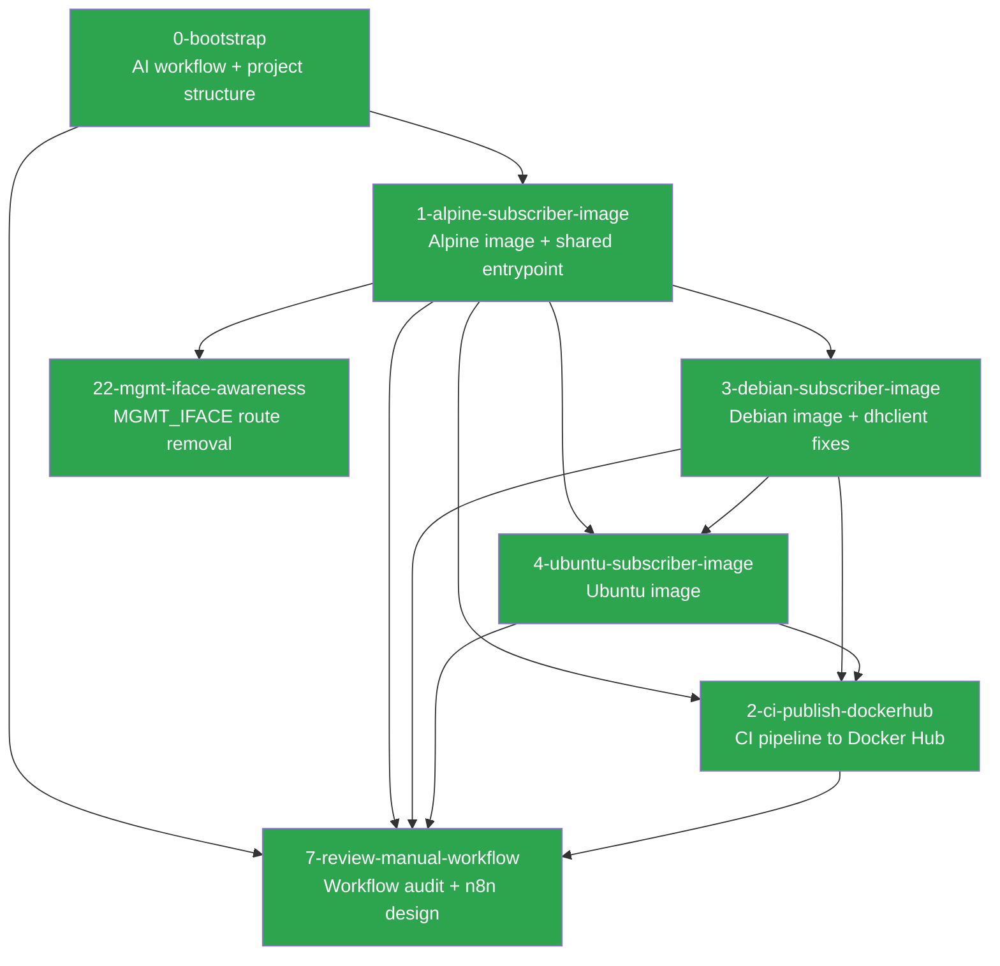

# bngtester — Project Summary

This file is the project-level state tracker. Every agent session should read this before starting new work. It tracks what has been built, key decisions that affect future work, and how specs relate to each other.

**Updated after every spec is finalized.**

## Current State

Three subscriber images (Alpine, Debian, and Ubuntu) are built and published to Docker Hub via a CI pipeline. The shared entrypoint script supports all access methods and encapsulation types, with auto-detected DHCP client dispatch for both dhcpcd and dhclient. The AI workflow has been refined with early branching, priority labels, spec approval gates, and a standardized PR format. A workflow consistency audit (#7) found core spec/implementation phases consistently followed, with gaps in label lifecycle, Phase 6 tracking, and commit discipline — n8n has been selected as the automation tool to address these.

## Completed Specs

| Spec | Issue | Status | Summary |
|------|-------|--------|---------|
| [0-bootstrap](specs/0-bootstrap/) | N/A | Complete | AI workflow (PROCESS.md, CLAUDE.md), issue templates, README, contribution rules |
| [1-alpine-subscriber-image](specs/1-alpine-subscriber-image/) | [#1](https://github.com/veesix-networks/bngtester/issues/1) | Complete | Alpine subscriber image + shared entrypoint (VLAN, IPoE, PPPoE) |
| [3-debian-subscriber-image](specs/3-debian-subscriber-image/) | [#3](https://github.com/veesix-networks/bngtester/issues/3) | Complete | Debian 12 subscriber image + dhclient entrypoint fixes |
| [4-ubuntu-subscriber-image](specs/4-ubuntu-subscriber-image/) | [#4](https://github.com/veesix-networks/bngtester/issues/4) | Complete | Ubuntu 22.04 subscriber image (Dockerfile only, no entrypoint changes) |
| [2-ci-publish-dockerhub](specs/2-ci-publish-dockerhub/) | [#2](https://github.com/veesix-networks/bngtester/issues/2) | Complete | CI pipeline to build and publish subscriber images to Docker Hub |
| [7-review-manual-workflow](specs/7-review-manual-workflow/) | [#7](https://github.com/veesix-networks/bngtester/issues/7) | Complete | Workflow consistency audit + n8n automation design |
| [22-mgmt-iface-awareness](specs/22-mgmt-iface-awareness/) | [#22](https://github.com/veesix-networks/bngtester/issues/22) | Complete | Management interface default route removal |

## Spec Dependencies

Legend: green = complete, blue = in progress, grey = planned

## Key Decisions

Decisions that affect future specs. Read these before proposing new work.

### From #8, #9, #10, #11 (workflow improvements)

- **Branch at Phase 1, not Phase 5.** All work for an issue — spec artifacts, reviews, and code — lives on a single feature branch from the start. Review agents check out the branch.
- **Priority labels decouple order from issue number.** `priority:p0` (critical path), `priority:p1` (important), `priority:p2` (nice to have). All issue templates have a priority dropdown.
- **Spec approval gate between Phase 4 and Phase 5.** `spec:approved` label required before implementation. Human contributors open a draft PR for spec review. n8n auto-approves when no unresolved CRITICAL/HIGH findings.
- **PR creation is a required final step of Phase 5.** Conventional Commits title format. Standardized body template with summary, spec link, files, testing. Agent-agnostic attribution.

### From 1-alpine-subscriber-image

- **Shared entrypoint auto-detects DHCP client.** `images/shared/entrypoint.sh` uses `command -v dhcpcd` / `command -v dhclient` at runtime. Future images (Debian, Ubuntu) use the same script — no per-image entrypoints needed.
- **Build context is `images/`, not per-image.** All Dockerfiles use `docker build -f images/<distro>/Dockerfile images/` so they can COPY from `shared/`.
- **bng-client will replace the shell entrypoint.** The planned Rust binary handles VLAN setup, client management, and health reporting. The current entrypoint is the minimum viable approach.
- **Subscriber containers require a dedicated network interface.** Default Docker bridge is not suitable. Use `--network none` + injected veth/macvlan, a dedicated Docker network, or `--network host`.

### From 3-debian-subscriber-image

- **dhclient requires config file for DHCP_TIMEOUT.** dhclient has no CLI flag for timeout — the entrypoint generates `/tmp/dhclient-bngtester.conf` with `timeout N;` and passes it via `-cf`. Future images using dhclient inherit this automatically.
- **Debian images need `ca-certificates` and `netbase`.** `bookworm-slim` lacks CA certs (needed for curl HTTPS) and `/etc/protocols` + `/etc/services` (needed by networking tools). Future Debian-based images should include both.

### From 4-ubuntu-subscriber-image

- **Ubuntu ships `timeout 300;` in stock dhclient.conf.** The entrypoint's `generate_dhclient_conf()` handles this correctly by appending `timeout $DHCP_TIMEOUT;` at the end of the copied config — dhclient uses the last directive. Future dhclient-based images should verify their stock config for conflicting directives.
- **`DEBIAN_FRONTEND=noninteractive` for Ubuntu Dockerfiles.** Ubuntu's apt may trigger interactive prompts during package installation. Use `DEBIAN_FRONTEND=noninteractive` inline in the RUN command.

### From 2-ci-publish-dockerhub

- **Three-job pipeline: discover → build → push.** The push job only runs after all build legs succeed, preventing partial Docker Hub publication. The build job validates Dockerfiles without pushing.
- **Dynamic image discovery.** The workflow finds `images/*/Dockerfile` directories automatically. Adding a new subscriber image requires only its Dockerfile — no workflow edits needed.
- **`latest` strictly follows `main`.** Semver tags publish version tags only. `latest` is never updated by tag events.
- **PR trigger for build-only validation.** Pull requests targeting `main` run the build job without pushing, catching Dockerfile errors before merge.
- **Docker Hub secrets required.** `DOCKERHUB_USERNAME` and `DOCKERHUB_TOKEN` must be configured in repository settings.

### From 7-review-manual-workflow

- **n8n is the automation tool, self-hosted via Docker Compose on BSpendlove's server cluster.** PostgreSQL backend (not SQLite) for crash recovery of long-lived wait nodes.
- **Phase 4 auto-accept: CRITICAL requires human 👀 ack, HIGH auto-accepts, MEDIUM/LOW get 24hr grace period.** `/reject <ID> <rationale>` to reject, `/approve` or 🚀 to fast-track.
- **Review agents must commit and push artifacts.** PROCESS.md updated to require explicit commit+push for Phases 2, 3, and 6. This was the most common failure mode in manual workflow.
- **Labels are the automation contract.** Label drift on closed issues must be backfilled before n8n depends on them. n8n must own label lifecycle going forward.
- **Phase 6 is opt-in, not implied by agents:all-three.** Automation must use an explicit trigger (label or command), not infer intent from agent-selection labels.
- **Structured review contract needed before deterministic parsing.** Current review artifacts are free-form Markdown. n8n should use LLM parsing as interim, then migrate to a fixed format (YAML front matter, Markdown table, or JSON sidecar).
- **Stale issue policy uses explicit states.** `blocked`, `waiting-on-maintainer`, `snoozed` labels prevent premature auto-close. Only unmarked unapproved issues get stale-closed after 30+14 days.
- **Security model for self-hosted n8n.** Webhook HMAC verification, replay protection via `X-GitHub-Delivery`, least-privilege repo-scoped PAT, `/reject`/`/approve` command authorization (write-access only), repo and branch allow-listing, 90-day secret rotation, and audit logging for all repo-mutation actions.
- **Failure recovery and idempotency required.** Persisted run keys to prevent double-runs, webhook deduplication, PostgreSQL for wait-node crash recovery, partial failure handling with resume-from-failed-step, and watchdog timers (15min) for agent execution.
- **API-invoked agents need context injection.** When n8n invokes agents via API (not CLI), it must read and inject branch state (spec, source files, SUMMARY.md) into the prompt.

### From 22-mgmt-iface-awareness

- **`MGMT_IFACE` removes only the default route, not the interface.** The connected route for the management subnet is preserved so orchestrators can still reach the container's management IP. This is critical for containerlab and similar tools where management access is needed for API/metrics.

### From 0-bootstrap

- **Gemini produces review artifacts, not direct spec edits.** All review agents write to `spec-reviews/` — Claude is the only agent that modifies the spec itself (Phase 4).
- **Spec paths use `<issue-number>-<slug>/` convention.** Deterministic, derived from the GitHub issue.
- **One feature per PR, one PR per issue.** No bundling. Out-of-scope discoveries become new issues.
- **`approved` label gates work.** No spec work begins until the issue has the `approved` label.

## Codebase State

| Component | Exists | Notes |
|-----------|--------|-------|
| `images/` | Yes | Alpine + Debian + Ubuntu images, shared entrypoint (`images/shared/entrypoint.sh`, `images/alpine/Dockerfile`, `images/debian/Dockerfile`, `images/ubuntu/Dockerfile`) |
| `collector/` | No | Go collector not started |
| `.github/workflows/` | Yes | `publish-images.yml` — builds and publishes subscriber images to Docker Hub |
| `context/` | Yes | Workflow docs and bootstrap spec |
| `.github/ISSUE_TEMPLATE/` | Yes | Feature, bug, enhancement, testing templates |
